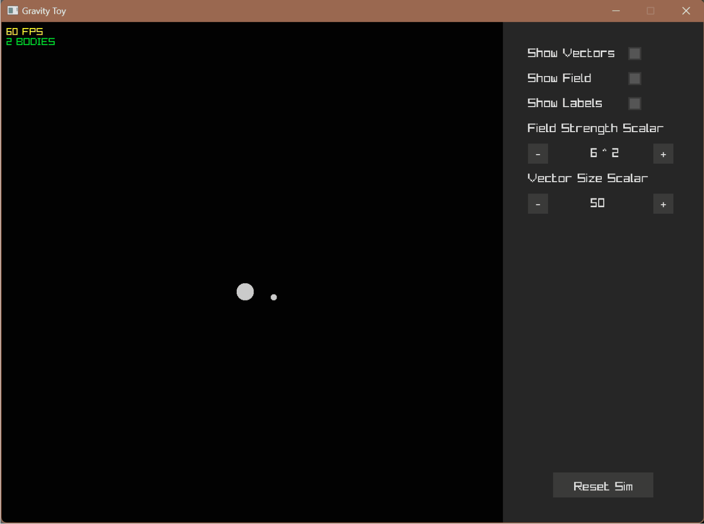

# Gravity Sandbox

### Overview
A 2D gravitational simulation using C++ and the Raylib library. This project simulates bodies interacting under the influence of gravity, with features like collision detection, body merging, and visual vector representation.

### Features
* **Realistic Gravity Calculation**: Based on Newton's Law of Universal Gravitation.
* **Collision Detection**: Bodies merge upon collision, conserving momentum and mass.
 
* **UI Elements**: Includes a graphical menu for adjusting simulation parameters.
* **Vector Visualization**: Option to show velocity vectors for each body.
* **Gravity Field Heatmap**: Option to show a heatmap representing the total gravitational force at any point in the simulation space.
 
###### ***This gif shows color artifacts appearing due to compression that are not present in the actual program.***
* **Screen Wrapping**: Bodies wrap around the screen edges, with physical interactions properly accounting for toroidal space.

### Installation
##### Prerequisites
* C++ compiler with C++ 17 or higher.
* Raylib 5.5 installed.
* *** Your device must support OpenGL. ***

##### Steps: 

1. Clone the repository.
```git clone [github.com/brandonacjones/gravity-sandbox]```
2. Install Raylib if not already installed.
3. Compile the Code.

### Usage
* Run the compiled executable:
``` ./gravity_sim ```
* **Interact with the simulation:**
     * Click and drag in the simulation area to create new bodies with initial velocity.
     * Use the checkbox to toggle vector visualization.

### Code Structure
* ##### **Main Components:**
     * ###### UI
     * `Button`: Custom UI button class for user interaction.
     * `CheckBox`: Toggle button class for user interaction.
     * ###### Simulation
     * `Body`: Represents celestial bodies with mass, radius, velocity, and position.
     * `bodySpawner`: Handles creation of new bodies.
     * `fieldCell`: Represents each grid unit of the gravity field heatmap.
     * `fieldGrid`: Handles the rendering and calculations of the heatmap.
* ##### **Key Functions:**
     * `calculateGravitationalForce`: Computes force between two bodies.
     * `checkCollision`: Detects if bodies collide, leading to merging.

### License
**MIT License**

Permission is hereby granted, free of charge, to any person obtaining a copy of this software and associated documentation files (the "Software"), to deal in the Software without restriction, including without limitation the rights to use, copy, modify, merge, publish, distribute, sublicense, and/or sell copies of the Software, and to permit persons to whom the Software is furnished to do so, subject to the following conditions:

The above copyright notice and this permission notice shall be included in all copies or substantial portions of the Software.

THE SOFTWARE IS PROVIDED "AS IS", WITHOUT WARRANTY OF ANY KIND, EXPRESS OR IMPLIED, INCLUDING BUT NOT LIMITED TO THE WARRANTIES OF MERCHANTABILITY, FITNESS FOR A PARTICULAR PURPOSE AND NONINFRINGEMENT. IN NO EVENT SHALL THE AUTHORS OR COPYRIGHT HOLDERS BE LIABLE FOR ANY CLAIM, DAMAGES OR OTHER LIABILITY, WHETHER IN AN ACTION OF CONTRACT, TORT OR OTHERWISE, ARISING FROM, OUT OF OR IN CONNECTION WITH THE SOFTWARE OR THE USE OR OTHER DEALINGS IN THE SOFTWARE.

### Acknowledgements
* Raylib for providing an easy-to-use game development library.
